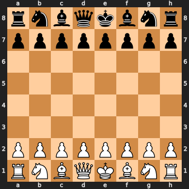
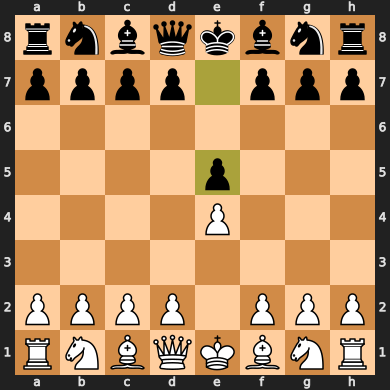

# Coding & Research at InfluenceMap

## Getting Started

Python is a popular and widely used programming language. Its popularity comes from its ease of use and range of capabilities. Python can be used for data analysis, data visualization, web development, machine learning and much much more. Python is open source meaning that it is completely free to download and use and the entire base of code it is built on is accessible to the public. 

We will be programming in Python using [Jupyter Notebooks](https://jupyter.org/index.html). Jupyter Notebooks are special types of files that provide a nice coding environment by allowing you to toggle between text and code. Notebooks also allow you to run sections of code one bit at a time, which is really handy for building your code up piece by piece. 

There are a lot of places where you can run notebooks, but today we will be using a online tool called Google Colab. To create your first Jupyter Notebook, go to [Google Colab](https://colab.research.google.com/), click `file` and click on `New file`. This will open a new blank Notebook and you will now be ready to start coding.

*Note: For future reference if you want to program using Jupyter Notebooks, Python or R I recommend downloading [Anaconda](https://www.anaconda.com/distribution/) if you havn't already. Anaconda is a coding package that comes with lots of great features to make using code for data analysis easier and it comes with Python and JupyterLab.*

## Running code in Jupyter Notebooks

To toggle between text and code in your Notebook, click on the `+ Code` or `+ Text` buttons on the top left of your screen.

To run the cell and see the output just press "shift+enter". You can rerun cells as much as you like and in any order.

Try running this simple code. You can rewrite the code in your notebook or you can just copy and paste it.


```python
print('Hello World')
```

    Hello World
    

## Basic Python objects

What is happening in the code above, is the inbuilt `print()` Python function is telling Python to print the text `"Hello World"`. In Python any time you want to handle plain text you need to put it in quotation marks `"" ` or `''`, this is what is referred to as a string.

To define a variable just use the equal sign. Here we are defining the variable `x` as equal to 1. 


```python
x = 1
```

We can now call the variable `x` and see that Python has remembered what value we gave that variable


```python
x
```


    1


Now we can do whatever we like with that variable and instantly see the result


```python
x + 1
```


    2


We can also use it to create variables 


```python
y = x + 1

print(y)
```

    2
    

In Python you can easily redefine a variable by using the equal sign again. e.g


```python
y = 3

print(y)
```

    3
    

This means you can redefine a variable by making it equal to an operation on itself. e.g. Every time you run this code, x will increase by a value of one. Whilst this would make no sense as a mathematical equation, it is very useful feature for coding.


```python
x = x + 1

x
```


    2


Variables can be any type of object in Python, not just numbers. E.g.


```python
hello_world_string = "Hello World"

print(hello_world_string)
```

    Hello World
    

Notice how our variable name has underscores in it. This is because Python gives meaning to spaces in text so we have to use underscore to tell python that hello_world_string is one Python object. If you were to type `hello world string = "Hello World"` Python would think you were referring to three separate objects `hello`, `world` and `string` and get confused.

Numbers can be strings too. To make a number a string just use the str() function. This allows you to add numbers to strings of text. This is useful for producing statements based on bits of data your code is evaluating.


```python
a = 2

a_string = str(a) 

new_string = hello_world_string + " " + a_string

print(new_string)
```

    Hello World 2
    

While JupyterLab lets you switch between text and code, you can also add annotations to your code using a hashtag


```python
# In Python anything in a line after a hastag is ignored
# eg
# print('Hello World')
```

## Lists and dictionaries

In Python you often want to store more than one piece of information in an object. There are many ways of doing this, but a common methods native to Python are lists and dictionaries.

Lists are well lists of objects and are written as follows.


```python
company_list = ['ExxonMobil', 'Shell', 'Total']
```

The following is a list of strings but lists can contain any type of Python object. To pull an item from a list you use the number associated with that item. Python starts counting from zero, so to get the first object from a list you can use the following code.


```python
company_list[0]
```


    'ExxonMobil'


`Shell` would be `company_list[1]` and `Total` would be `company_list[2]`. An easier way to get the last item in the list is to use


```python
company_list[-1]
```


    'Total'


To get the length of a list just use the `len()` function. This will come in handy later when we start to do more advanced operations on lists.


```python
len(company_list)
```


    3


You can also have lists inside of lists. These are called arrays and you can think of them as tables.


```python
array = [['Company', 'Org Score'],
        ['ExxonMobil', '41'],
         ['Shell', '57']]
```

You can pull information from an array the same way as a list except that the first value you pull will be a list and the second object will be the object. Eg to get Exxon's score you would run


```python
array[1][1]
```


    '41'


However, arrays aren't that useful to work with data so we tend to use dataframes instead. But more on that later.

Dictionaries are objects in Python that store information using names of those values. 


```python
exxon_dict = {'name': 'ExxonMobil', 
                'sector': 'Energy', 
                'orgscore': 41}
```

To call a value from a dictionary, just use the value name


```python
exxon_dict['orgscore']
```


    41


## More interesting aspects of Python

You might be struggling to see the use of being able to create basic objects in Python. But it what you can build on top of these basic concepts that can be really powerful. In this section we will go through some of the more interesting concepts in Python that are used to build a kind of 'logic' into your program.

### Logical operators

In Python you can build simple logic into your code using the `if` statement. Here is an example:


```python
a = 1
b = 2

if a == b:
    print('a is equal to b')
else:
    print('a is not equal to b')
```

    a is not equal to b
    

Here the `if` statement is used to see if `a` is equal to `b`. 

**Notice how the `print` statements are four spaces away from the margin and after a `:`. This is the syntax used by Python to tell it that the print statements sit within the `if` function and should only be excecuted `if` the `==` statement following the `if` is true. This universal syntax in Python and you will see it pop up a lot. In most code editors, including JupyterLab, you can create the four spaces by pressing the tab button.

In Python the `==` sign is used to see if two elements are the same and will return `True` or `False`.


```python
2 == 2
```


    True


```python
1 == 2
```


    False


The `True` or `False` returned by the `==` sign aren't just strings, but Python objects in themselves that can be read by the `if` operator. As shown below, the `if` operator will read the `True` and `False` objects.


```python
if True:
    print('This should be printed')

if False:
    print('This should not be printed')
```

    This should be printed
    

Notice how the `True` and `False` are not in quotation marks like a string. 

**Also** note how the first letter of both of them is capitalized. Python is case sensitive so when writing code be sure to use the correct cases when referring to a Python object. The code below should fail as Python has no object called `false` in it's memory.


```python
false
```


    ---------------------------------------------------------------------------

    NameError                                 Traceback (most recent call last)

    <ipython-input-1-b73d74fcede9> in <module>
    ----> 1 false
    

    NameError: name 'false' is not defined


Now the power of the `True` and `False` objects in combination with the `if` operator is that it lets you build logic into your code. 

For example say you were writing some code that told you if a company's lobbying score was alinged with the Paris Agreement or not.


```python
company_org_score = 48
company_name = 'Hyundai'

if company_org_score >= 50:
    print_string = company_name + "'s lobbying is aligned with the Paris agreement"
    print(print_string)

if company_org_score < 50:
    print_string = company_name + "'s lobbying is not aligned with the Paris agreement"
    print(print_string)
```

    Hyundai's lobbying is not aligned with the Paris agreement
    

### Loops

A core and very powerful concept of coding and Python is loops. These are commands that let you loop through objects in code. Remember lists from earlier, loops can be used to iterate through the objects in a list


```python
company_list
```


    ['ExxonMobil', 'Shell', 'Total']


```python
for company in company_list:
    print(company)
```

    ExxonMobil
    Shell
    Total
    

Here we are defining a new object `company` as any object in that list and telling Python what to do with that object. Notice again how we are using the `:` and the four spaces to tell python that the print object.

Anther useful kind of loop is the `while` loop. A while loop will run a section of code whilst a condition is true.


```python
i = 0

while i <= 10:
    print(i)

    i = i + 1
```

    0
    1
    2
    3
    4
    5
    6
    7
    8
    9
    10
    

Notice how I change the value of `i` on each run. If you were to leave this out then the loop would continue printing zero forever (which we generally want to avoid).

### Functions

Anther core concept in coding in Python is functions. Using `def` allows you to define a function that can take inputs, run a section of code and return results. This is core concept in coding lets you break down your code into little bits of code that are good at doing specific jobs.


```python
def add_up(a, b):
    c = a + b

    return c
```

Python now has a function saved called `add_up` that will add two values together


```python
c = add_up(12, 60)

c
```


    72


This is a boring function but you can really put anything inside a function and it is really key to building up complex code. 

## Importing code

Thankfully you don't have to write every function yourself, you can also install and import code other people have written. One of the things that makes Python great is the huge amount of support and modules that exists around it.

There are a number of ways to install Python code but the most common way is to use the Python package manger `pip`. In general to install a package you would run the following code in your terminal or Jupyter Notebook cell:

```
pip install package_name
```

For example there is a Python package called [chess](https://pypi.org/project/chess/) that comes with a bunch of functions and tools for modelling chess games. To install it we would run `pip install chess`.


```python
pip install chess
```

    Collecting chess
      Downloading chess-1.6.1-py3-none-any.whl (146 kB)
    Installing collected packages: chess
    Successfully installed chess-1.6.1
    Note: you may need to restart the kernel to use updated packages.
    

Now we can import functions from this module


```python
import chess

board = chess.Board()

board
```


    

    


See how chess comes with the ability to show the chess board in Jupyter. I wouldn't even know where to start if I wanted to write some code that did that. But luckily I don't have to, someone else wrote the code and I can install and run it for free.

Back to the chess module we can now run moves and see how they change the board with the following code.


```python
board.push_san("e1e3")

board
```


    

    


Have a play with the text in the `.push_san` function and try rerunning the cells. In chess you can write a move by typing the position a piece starts in followed by the position the piece ends in.

## Next steps

Now we have covered the basics lets try using the code in a more practical scenario. Open the `Python_in_use` file and start working through it. 
