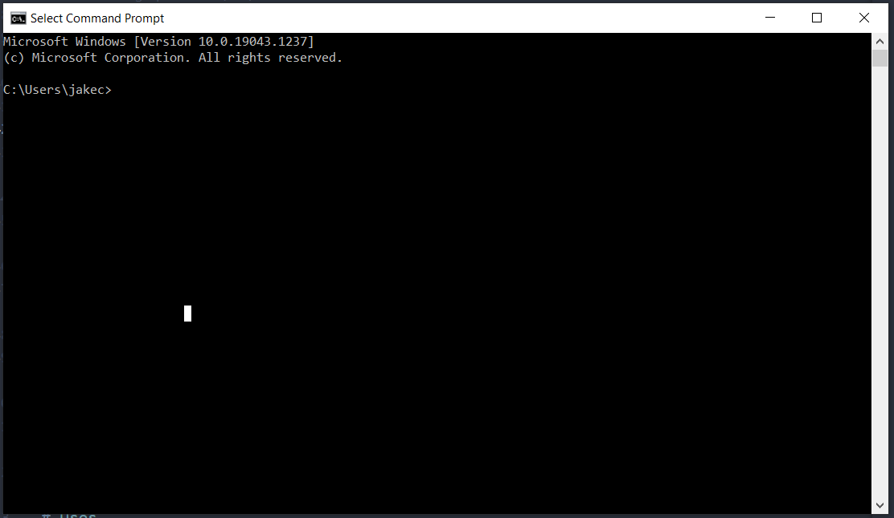

# **Coding & InfluenceMap**

**An introduction to coding and how it is used at InfluenceMap**

---

## Introduction

Wikipedia describes coding as:

"The process of designing and building an executable computer program to accomplish a specific computing result or to perform a specific task."

However, the best way I have heard coding described is as "The language your computer speaks" and hence the language you have to speak if you want to best communicate with a computer. 

---
## What makes code so powerful 


Whilst the high evaluation of coding as a skill probably has a lot to do with who typically codes, there are some features inherent to coding that make it very powerful:

* Code is reusable 
* Code is easily replicable
* Tasks written in code can be easily automated
* Code is incredibly flexible 
* As we rely more and more on the digital world, code gets more and more useful

---
## Functions and modules

* A core concept in coding are functions and modules.

* Functions are snippets of code that are very good at specific jobs. Then instead of writing the same code out again, next time you come across a task you can just call that function.

* There is a whole universe of free installable modules, developed by other people, that you can install and use in your own code.

---

## The terminal - Introduction

The quickest way to get to coding on your computer is to use the command line. The command line acts as a tool for giving you most of the functionality of your computer through a coding language. 



---

## The terminal - A quick experiment

Type `cmd` into your search box at the bottom left of your screen, click on `command prompt` and a black box should open up. This is your terminal. Lets try to use the terminal to have a quick look around and open a file.

```
C:\Users\jakec>dir

C:\Users\jakec>cd Documents

C:\Users\jakec>dir

C:\Users\jakec>start FILE_NAME
```


---
## The terminal - Summery

You can really do a lot with your command line but I mostly use it for:
* Managing what coding packages I have installed
* Managing files
* Running code scripts I have written
* Saving code remotely
* Connecting to servers
* Editing files

---
## Python and server-side languages

* Python is one of the worlds most popular coding languages, it runs on all the major operating systems, has a relatively intuitive syntax for a coding language and has a huge amount of online support. 

* This the language we will be working through later.

* Python is server-side language, meaning you download it and run it on your computer.

* Due to it's ease of use, Python is often used to control other programming tools written in other languages. In this sense Python is sometimes described as a glue that holds more complex applications together.

---
## Python Uses

#### 1) Data Analysis

* At InfluenceMap we use Python for all of our data analysis.

* Python's syntax makes it easier to understand and check code.

* There are a lot of Python packages that can be easily installed and used for data analysis, such as Pandas and Numpy.

* Python makes it easier to work with external databases.

---
## Python Uses

#### 1) Data Analysis - FinanceMap

* Pretty much the entire portfolio analysis process, used for content like the climate funds report and Asset Managers & Climate Change, is in code. 

* Python is used to pull data on fund holdings and companies from Refinitiv, this is fed into the PACTA code in R to give Portfolio Paris alignment results, and then back into Python to calculate our specific FinanceMap portfolio scores. 

* Finally some more code on Chris’ side feeds everything into the FinanceMap platform

---
## Python Uses

#### 2) Data Viz

* At InfluenceMap we use Python for a lot of our data viz.

* There are a ton of packages in Python for making interactive graphs.

* We like to use [Plotly](https://plotly.com/python/), which is a free package that allows you to easily make interactive graphs packed full of features.

* We have also developed our [own modules](https://git.influencemap.org/JakeCarbone/IM-Plotly-Functions) that contain code for styling preparing the Plotly graphs.

---
## Python Uses

#### 3) Scrapping, Brian and Evidence Tracker

* Python is a great language for scraping, as there are a whole host of Python packages out there to make scraping easier. Python is what all the scrapers InfluenceMap uses are made in.

* For example, a lot of sites don't want you scraping their information, so make it hard for scrapers to access the site. The Python Selenium package lets you write Python code that can control a Chrome or Firefox browser and use that to access the page and pull information from it. This is much harder for a website to differentiate from a normal user.

---
## Python Uses

#### 4) Apps (Like Brian)

* Python is well suited for making apps.

* Because Python is so popular, many companies, like Slack and Dropbox, produce Python modules to help coders write code to interact with their services.

* Python allows me to write one bit of code that can read slack messages and put that in a function, write anther function that does the scraping and anther function that saves the results to dropbox. I then just need to tie that all together to make Brian.  

--- 

## Python Uses

#### 5) Websites

* On at a high level, a website is run by some code on a server that will get requests from users, pull the relevant data from a database and send back a response.  

* Python's gluey nature makes it a great choice for making websites.

* There are a number of Python modules that provide frameworks for building websites, like [Django](https://www.djangoproject.com/), [Flask](https://flask.palletsprojects.com/en/2.0.x/) and [Pelican](https://blog.getpelican.com/). At InfluenceMap we use a framework, custom made by Chris, called Evoke.

---
## Python Uses

#### 5) Websites - Evoke

* InfluenceMap sites and CRM use the Evoke Web Application platform. The sites logic is written in Python, which receives user requests and pulls the relevant data from a MySQL database.

* Evoke then uses front end templates, written in Nevo (anther custom design of Chris'), to design the code to be sent back to the user's browser. 


---

## Javascript and Front end languages

* Whilst the tutorial will focus on Python, lets quickly touch on front end languages.

* When a website receives and deals with a users request it will then send back some code to your browser. Your browser then runs this code and renders the image it creates. 

* This code is generally made up of three parts; HTML, CSS and Javascript. HTML makes up the building blocks of what you see, text, boxes etc. CSS styles that html, telling the browser what fonts, sizes colours to use etc. Javascript is the really interesting bit. It is the coding language your browser will understand and run.

---
## Javascript at InfluenceMap

* Javascript is often used to add functionality and interactive behavior to a web page. 

* Some of this stuff happens behind the scenes e.g. making calls for data from the server or interacting with/editing the page in order to make it look correct on different devices

* Javascript is also used in visible elements, like dropdowns, foldouts and menu's etc. There are also a bunch of different js libraries which can be used to enhance webpages, a couple we use fairly often are D3.js for data visualization and jQuery which makes interacting with the page much simpler.

---
## Notes

* The logic behind coding can seem a little alien at first but don't let that deter you. It will come with time and once you are comfortable with one language it will really help you learn other languages.

* Coding is like 5% writing code and 95% trying to figure out why your code isn't working. Again don't let that deter you.

* Getting set up and installing Python can be a surprisingly difficult task. So don't feel put off if that takes you a while.

---

## Resources

* Code Hub team - If you want to continue learning code feel free to reach out to the Code Hub team. We have weekly meetings to discuss code and are trying to support the development of coders at InfluenceMap. 

* [First Python Notebook course](https://www.firstpythonnotebook.org/) - This is a free tutorial developed for journalists and makes an excellent next step following the completion of our tutorial.

* The [InfluenceMap Data Visualization guide](https://git.influencemap.org/JakeCarbone/DV-guide) - This is a guide I made to making data visualizations covering both the theory behind good design and a guide to using Plotly in Python.

---
## Before we start the tutorials

# **Any Questions?**